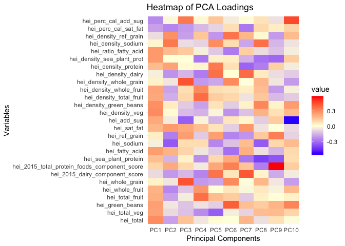
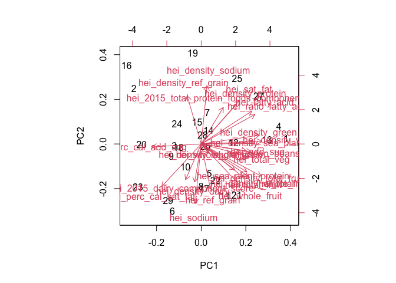
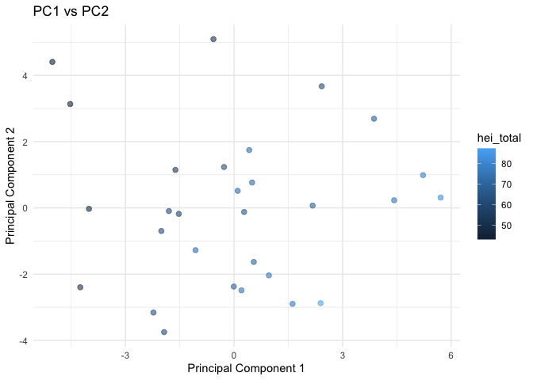
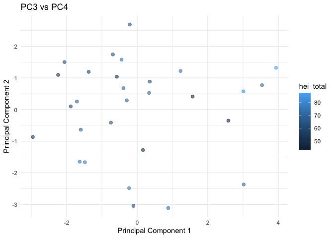

PCA and Corr heatmaps
================
Christine Lucille Kuryla
2024-11-25

``` r
# Load data version 202411211329
data <- read_csv("data/merge_data.csv")
```

    ## Rows: 39 Columns: 120
    ## ── Column specification ────────────────────────────────────────────────────────
    ## Delimiter: ","
    ## chr  (26): id, hydration, kidney, ketone, ph, calcium, vitamin_c, salinity, ...
    ## dbl  (89): freezer_box, freezer_location_of_aliquot_1, freezer_location_of_a...
    ## num   (1): q4
    ## lgl   (1): q53
    ## date  (3): storage_at_4c_date, aliquot_date, survey_date
    ## 
    ## ℹ Use `spec()` to retrieve the full column specification for this data.
    ## ℹ Specify the column types or set `show_col_types = FALSE` to quiet this message.

``` r
 data_diet <- data %>% 
  select(hei_total:hei_perc_cal_add_sug) %>% 
  na.omit()
```

## PCA of diet var with prcomp

``` r
pca_result <- prcomp(data_diet, scale = TRUE)


loadings <- pca_result$rotation

loadings <- loadings[,1:10]
```

### Loadings heatmap

``` r
# Convert the loadings matrix into a long format for ggplot
library(reshape2)
```

    ## 
    ## Attaching package: 'reshape2'

    ## The following object is masked from 'package:tidyr':
    ## 
    ##     smiths

``` r
loadings_melted <- melt(loadings)

# Plot the heatmap using ggplot
ggplot(loadings_melted, aes(x = Var2, y = Var1, fill = value)) +
  geom_tile() +
  scale_fill_gradient2(low = "blue", mid = "lightyellow", high = "red", midpoint = 0) +
  labs(title = "Heatmap of PCA Loadings", x = "Principal Components", y = "Variables") +
  theme_minimal()
```

<!-- -->

# biplot

``` r
biplot(pca_result)
```

<!-- -->

# PCA scatterplot

``` r
# Prepare data for plotting
scores <- as.data.frame(pca_result$x[, 1:6])  # Take PC1 and PC2
scores$hei_total <- data_diet %>% 
 # mutate(thirtyday_expire_flag = as.factor(thirtyday_expire_flag)) 
  pull(hei_total) 
#colnames(scores) <- c("PC1", "PC2", "PC3", "PC4", "PC5", "thirty_day")

# Plot
ggplot(scores, aes(x = PC1, y = PC2, color = hei_total)) +
  geom_point(size = 2, alpha = 0.6) +
  labs(title = "PC1 vs PC2", x = "Principal Component 1", y = "Principal Component 2") +
  theme_minimal() 
```

<!-- -->

``` r
as.data.frame(loadings) %>%
  select(PC1) %>% 
  arrange(PC1)
```

    ##                                                      PC1
    ## hei_perc_cal_add_sug                         -0.23945876
    ## hei_perc_cal_sat_fat                         -0.19126622
    ## hei_2015_dairy_component_score               -0.07579367
    ## hei_density_ref_grain                        -0.06837036
    ## hei_density_dairy                            -0.03176401
    ## hei_sodium                                   -0.02922103
    ## hei_density_sodium                            0.02831005
    ## hei_whole_grain                               0.03546338
    ## hei_density_whole_grain                       0.03698907
    ## hei_ref_grain                                 0.04488539
    ## hei_2015_total_protein_foods_component_score  0.10735227
    ## hei_sea_plant_protein                         0.16222292
    ## hei_density_protein                           0.17149152
    ## hei_sat_fat                                   0.18564601
    ## hei_whole_fruit                               0.19028695
    ## hei_total_fruit                               0.20274404
    ## hei_add_sug                                   0.21949902
    ## hei_density_total_fruit                       0.22140285
    ## hei_density_whole_fruit                       0.22654994
    ## hei_total_veg                                 0.23496043
    ## hei_green_beans                               0.24148248
    ## hei_fatty_acid                                0.24644314
    ## hei_density_sea_plant_prot                    0.25919523
    ## hei_ratio_fatty_acid                          0.26095951
    ## hei_density_green_beans                       0.28242037
    ## hei_total                                     0.29150630
    ## hei_density_veg                               0.29415360

``` r
# Plot
ggplot(scores, aes(x = PC3, y = PC4, color = hei_total)) +
  geom_point(size = 2, alpha = 0.6) +
  labs(title = "PC3 vs PC4", x = "Principal Component 1", y = "Principal Component 2") +
  theme_minimal() 
```

<!-- -->
