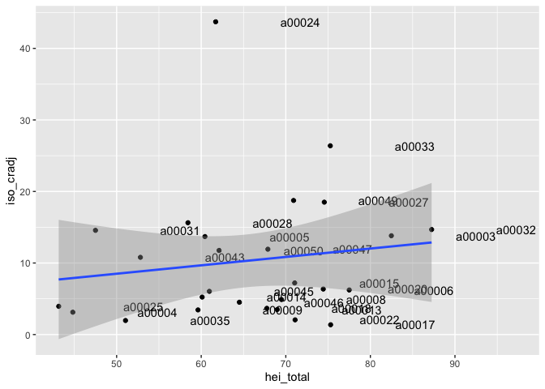
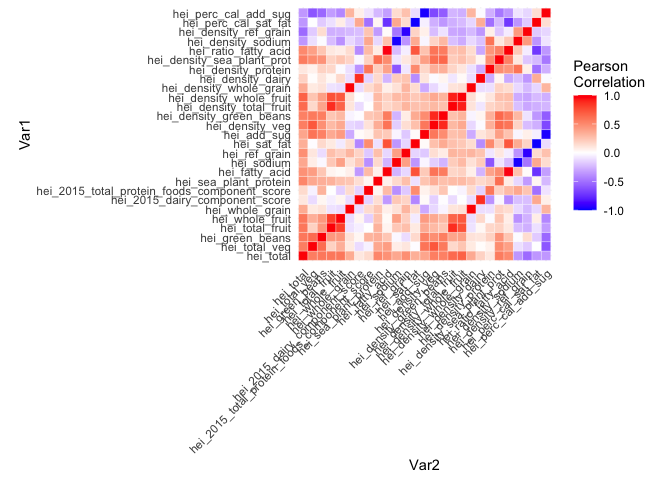
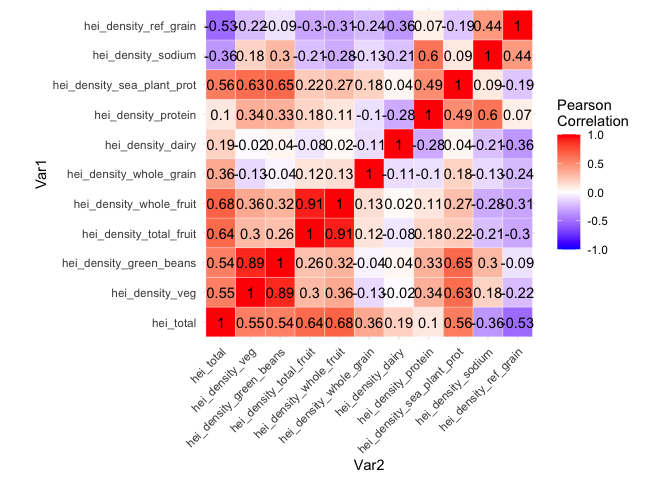
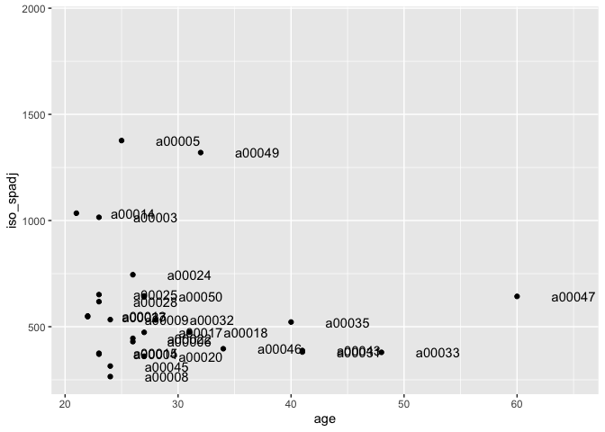
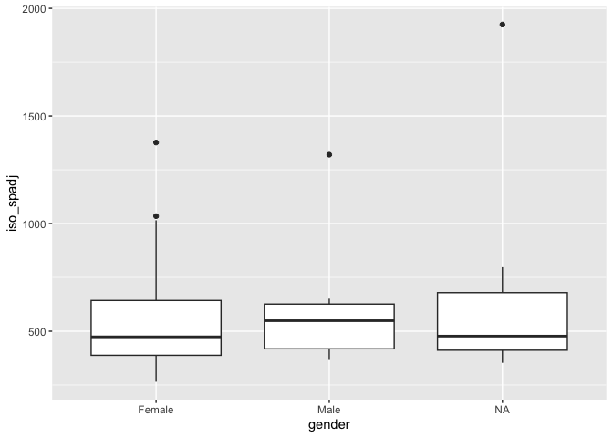
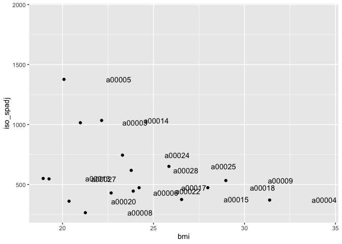

Mol Epi Mock Study
================
Christine Lucille Kuryla
2024-11-21

<https://docs.google.com/document/d/1Q7SPJ6jG5DpU9rxNhNgf3ro_XE324vxrlF-itp2etUc/edit?tab=t.0>

<https://docs.google.com/presentation/d/1-_SB_NDSO_z_84U7QyzO2zf9GRk6RMJdB8-q4KWfU0Q/edit#slide=id.p>

``` r
# Load data version 202411211329
data <- read_csv("data/merge_data.csv")
```

    ## Rows: 39 Columns: 120
    ## ── Column specification ────────────────────────────────────────────────────────
    ## Delimiter: ","
    ## chr  (26): id, hydration, kidney, ketone, ph, calcium, vitamin_c, salinity, ...
    ## dbl  (89): freezer_box, freezer_location_of_aliquot_1, freezer_location_of_a...
    ## num   (1): q4
    ## lgl   (1): q53
    ## date  (3): storage_at_4c_date, aliquot_date, survey_date
    ## 
    ## ℹ Use `spec()` to retrieve the full column specification for this data.
    ## ℹ Specify the column types or set `show_col_types = FALSE` to quiet this message.

``` r
#data_to_analyze <- data %>% 
 # select(-c())
```

oxidative stress was measured in two ways

1)  dipstick commercial kit
2)  ELISA

## Dipstick

``` r
# NEED TO SELECT THE NUMERIC ONES ONLY AND MAYBE CONVERT THE FACTORS
data_dipstick <- data %>% 
  filter(!(is.na(hydration))) %>% 
  select(hydration:free_radical, iso_cradj, iso_spadj)

# Summary

# Correlation Matrix of Dipstick Variables


melted_cormat <- reshape2::melt(cor(data_dipstick), na.rm = TRUE)

ggplot(data = melted_cormat, aes(Var2, Var1, fill = value))+
 geom_tile(color = "white")+
 scale_fill_gradient2(low = "blue", high = "red", mid = "white", 
   midpoint = 0, limit = c(-1,1), space = "Lab", 
   name="Pearson\nCorrelation") +
  theme_minimal()+ 
 theme(axis.text.x = element_text(angle = 45, vjust = 1, 
     hjust = 1))+
 coord_fixed() +
  geom_text(aes(Var2, Var1, label = if_else(value != 0, as.character(round(value, digits = 2)), " ")))

# Scatter plot of creatinine adj vs spadj

data %>% 
  ggplot((aes(x = iso_cradj, y = iso_spadj))) +
  geom_point() +
  geom_text(aes(label=id), nudge_x=10)

# Scatter plot creatinine vs specific gravity
data %>% 
  ggplot((aes(x = creatinine, y = sp))) +
  geom_point() +
  geom_text(aes(label=id), nudge_x=50)

# Executive decision: go with specific gravity

# Future directions: compare nutrient analysis from dipstick to DHQ
```

# Main Analysis: Diet Quality and Oxidative Stress

``` r
# heitotal = diet quality
# oxidative stressL iso_cradj, iso_spadj

# Diet quality vs oxidative stress
data %>% 
  filter(id != "a00029") %>% 
  ggplot(aes(x = hei_total, y = iso_cradj)) +
  geom_point() +
  geom_text(aes(label=id), nudge_x=10) +
  geom_smooth(method = "lm")
```

    ## `geom_smooth()` using formula = 'y ~ x'

    ## Warning: Removed 11 rows containing non-finite outside the scale range
    ## (`stat_smooth()`).

    ## Warning: Removed 11 rows containing missing values or values outside the scale range
    ## (`geom_point()`).

    ## Warning: Removed 11 rows containing missing values or values outside the scale range
    ## (`geom_text()`).

<!-- -->

``` r
summary(lm(iso_spadj ~ hei_total, data = data))
```

    ## 
    ## Call:
    ## lm(formula = iso_spadj ~ hei_total, data = data)
    ## 
    ## Residuals:
    ##     Min      1Q  Median      3Q     Max 
    ## -335.55 -215.29  -96.97   33.70  760.69 
    ## 
    ## Coefficients:
    ##             Estimate Std. Error t value Pr(>|t|)  
    ## (Intercept)  718.704    354.310   2.028   0.0529 .
    ## hei_total     -1.700      5.398  -0.315   0.7554  
    ## ---
    ## Signif. codes:  0 '***' 0.001 '**' 0.01 '*' 0.05 '.' 0.1 ' ' 1
    ## 
    ## Residual standard error: 314.6 on 26 degrees of freedom
    ##   (11 observations deleted due to missingness)
    ## Multiple R-squared:  0.003799,   Adjusted R-squared:  -0.03452 
    ## F-statistic: 0.09916 on 1 and 26 DF,  p-value: 0.7554

# Diet Subtypes

``` r
# PCA of the hei subtypes

data_diet <- data %>% 
  select(hei_total:hei_perc_cal_add_sug) %>% 
  na.omit()

pca_result <- princomp(data_diet, center = TRUE, scale = TRUE)
```

    ## Warning: In princomp.default(data_diet, center = TRUE, scale = TRUE) :
    ##  extra arguments 'center', 'scale' will be disregarded

``` r
loadings(pca_result)
```

    ## 
    ## Loadings:
    ##                                              Comp.1 Comp.2 Comp.3 Comp.4 Comp.5
    ## hei_total                                     0.941                            
    ## hei_total_veg                                              -0.116        -0.115
    ## hei_green_beans                                            -0.137              
    ## hei_total_fruit                                                   -0.179       
    ## hei_whole_fruit                                            -0.148 -0.181  0.126
    ## hei_whole_grain                                             0.304        -0.239
    ## hei_2015_dairy_component_score                       0.251 -0.120  0.856  0.153
    ## hei_2015_total_protein_foods_component_score                                   
    ## hei_sea_plant_protein                                                    -0.144
    ## hei_fatty_acid                                0.134 -0.411  0.117              
    ## hei_sodium                                           0.367        -0.342  0.638
    ## hei_ref_grain                                 0.122  0.342  0.243 -0.106 -0.541
    ## hei_sat_fat                                   0.102 -0.461  0.315         0.148
    ## hei_add_sug                                                -0.311              
    ## hei_density_veg                                                                
    ## hei_density_green_beans                                                        
    ## hei_density_total_fruit                                                        
    ## hei_density_whole_fruit                                                        
    ## hei_density_whole_grain                                                        
    ## hei_density_dairy                                                  0.158       
    ## hei_density_protein                                 -0.115               -0.201
    ## hei_density_sea_plant_prot                                               -0.113
    ## hei_ratio_fatty_acid                                                           
    ## hei_density_sodium                                                             
    ## hei_density_ref_grain                               -0.112                0.146
    ## hei_perc_cal_sat_fat                                 0.397 -0.256 -0.102 -0.126
    ## hei_perc_cal_add_sug                         -0.123  0.276  0.694         0.172
    ##                                              Comp.6 Comp.7 Comp.8 Comp.9
    ## hei_total                                                               
    ## hei_total_veg                                 0.129 -0.205  0.125  0.182
    ## hei_green_beans                               0.228  0.222  0.223  0.217
    ## hei_total_fruit                              -0.224  0.435  0.291       
    ## hei_whole_fruit                              -0.130  0.256  0.261  0.180
    ## hei_whole_grain                               0.704        -0.254  0.115
    ## hei_2015_dairy_component_score                                          
    ## hei_2015_total_protein_foods_component_score                            
    ## hei_sea_plant_protein                         0.113         0.154 -0.763
    ## hei_fatty_acid                                      -0.644  0.368       
    ## hei_sodium                                          -0.228 -0.274 -0.193
    ## hei_ref_grain                                -0.479 -0.140 -0.219  0.120
    ## hei_sat_fat                                  -0.186  0.198 -0.298       
    ## hei_add_sug                                                -0.253       
    ## hei_density_veg                                                         
    ## hei_density_green_beans                                                 
    ## hei_density_total_fruit                              0.104              
    ## hei_density_whole_fruit                                                 
    ## hei_density_whole_grain                       0.105                     
    ## hei_density_dairy                                                       
    ## hei_density_protein                                  0.114  0.120 -0.313
    ## hei_density_sea_plant_prot                                  0.114 -0.325
    ## hei_ratio_fatty_acid                                                    
    ## hei_density_sodium                                                      
    ## hei_density_ref_grain                         0.164  0.144              
    ## hei_perc_cal_sat_fat                          0.152 -0.172  0.247  0.114
    ## hei_perc_cal_add_sug                                        0.413       
    ##                                              Comp.10 Comp.11 Comp.12 Comp.13
    ## hei_total                                                                   
    ## hei_total_veg                                 0.317   0.211  -0.304   0.296 
    ## hei_green_beans                               0.615           0.104  -0.305 
    ## hei_total_fruit                              -0.284   0.314   0.402  -0.169 
    ## hei_whole_fruit                              -0.340  -0.359  -0.553   0.187 
    ## hei_whole_grain                              -0.352                         
    ## hei_2015_dairy_component_score               -0.149                         
    ## hei_2015_total_protein_foods_component_score  0.150  -0.253   0.311   0.406 
    ## hei_sea_plant_protein                                 0.371  -0.236         
    ## hei_fatty_acid                               -0.228           0.189         
    ## hei_sodium                                    0.117  -0.127                 
    ## hei_ref_grain                                 0.108                  -0.146 
    ## hei_sat_fat                                                  -0.174  -0.114 
    ## hei_add_sug                                                   0.197         
    ## hei_density_veg                                              -0.207  -0.157 
    ## hei_density_green_beans                                      -0.111  -0.191 
    ## hei_density_total_fruit                                       0.111  -0.170 
    ## hei_density_whole_fruit                                              -0.110 
    ## hei_density_whole_grain                                                     
    ## hei_density_dairy                                                     0.118 
    ## hei_density_protein                                  -0.526   0.252   0.268 
    ## hei_density_sea_plant_prot                           -0.406          -0.557 
    ## hei_ratio_fatty_acid                                                        
    ## hei_density_sodium                                                          
    ## hei_density_ref_grain                         0.102                  -0.122 
    ## hei_perc_cal_sat_fat                                 -0.142   0.103         
    ## hei_perc_cal_add_sug                          0.133                         
    ##                                              Comp.14 Comp.15 Comp.16 Comp.17
    ## hei_total                                                                   
    ## hei_total_veg                                -0.388   0.362   0.213  -0.298 
    ## hei_green_beans                                      -0.308  -0.218   0.137 
    ## hei_total_fruit                                               0.198  -0.318 
    ## hei_whole_fruit                                      -0.164           0.174 
    ## hei_whole_grain                                                             
    ## hei_2015_dairy_component_score                        0.159                 
    ## hei_2015_total_protein_foods_component_score  0.575   0.164                 
    ## hei_sea_plant_protein                         0.111  -0.118  -0.147   0.137 
    ## hei_fatty_acid                                                        0.122 
    ## hei_sodium                                                           -0.113 
    ## hei_ref_grain                                                         0.146 
    ## hei_sat_fat                                                                 
    ## hei_add_sug                                  -0.113  -0.156           0.188 
    ## hei_density_veg                               0.390   0.235  -0.322  -0.434 
    ## hei_density_green_beans                       0.258   0.132          -0.169 
    ## hei_density_total_fruit                      -0.130   0.263  -0.303         
    ## hei_density_whole_fruit                      -0.160   0.376  -0.525   0.178 
    ## hei_density_whole_grain                                                     
    ## hei_density_dairy                                    -0.484  -0.223  -0.513 
    ## hei_density_protein                          -0.372   0.203  -0.105         
    ## hei_density_sea_plant_prot                   -0.111           0.365  -0.157 
    ## hei_ratio_fatty_acid                                         -0.121   0.132 
    ## hei_density_sodium                                                          
    ## hei_density_ref_grain                         0.137   0.247   0.369   0.249 
    ## hei_perc_cal_sat_fat                          0.163   0.116           0.118 
    ## hei_perc_cal_add_sug                                                        
    ##                                              Comp.18 Comp.19 Comp.20 Comp.21
    ## hei_total                                                                   
    ## hei_total_veg                                                -0.111   0.119 
    ## hei_green_beans                                      -0.169                 
    ## hei_total_fruit                              -0.109                         
    ## hei_whole_fruit                                                             
    ## hei_whole_grain                                                             
    ## hei_2015_dairy_component_score                                              
    ## hei_2015_total_protein_foods_component_score  0.223  -0.153  -0.312         
    ## hei_sea_plant_protein                                                       
    ## hei_fatty_acid                                                       -0.105 
    ## hei_sodium                                                                  
    ## hei_ref_grain                                                               
    ## hei_sat_fat                                  -0.327   0.436  -0.144         
    ## hei_add_sug                                   0.505   0.412   0.398         
    ## hei_density_veg                               0.114           0.310  -0.354 
    ## hei_density_green_beans                                       0.389   0.562 
    ## hei_density_total_fruit                       0.160          -0.229         
    ## hei_density_whole_fruit                       0.307          -0.254         
    ## hei_density_whole_grain                                                     
    ## hei_density_dairy                             0.185   0.231  -0.344   0.254 
    ## hei_density_protein                          -0.175           0.278         
    ## hei_density_sea_plant_prot                    0.298          -0.198         
    ## hei_ratio_fatty_acid                                 -0.242           0.597 
    ## hei_density_sodium                                            0.148   0.230 
    ## hei_density_ref_grain                         0.156   0.207                 
    ## hei_perc_cal_sat_fat                         -0.379   0.574  -0.155         
    ## hei_perc_cal_add_sug                          0.265   0.222   0.197         
    ##                                              Comp.22 Comp.23 Comp.24 Comp.25
    ## hei_total                                                                   
    ## hei_total_veg                                                               
    ## hei_green_beans                                                             
    ## hei_total_fruit                                       0.122                 
    ## hei_whole_fruit                                                             
    ## hei_whole_grain                                                             
    ## hei_2015_dairy_component_score                                              
    ## hei_2015_total_protein_foods_component_score                  0.114         
    ## hei_sea_plant_protein                                                       
    ## hei_fatty_acid                               -0.132                         
    ## hei_sodium                                                           -0.142 
    ## hei_ref_grain                                                -0.154  -0.168 
    ## hei_sat_fat                                                   0.114   0.118 
    ## hei_add_sug                                                   0.123   0.110 
    ## hei_density_veg                               0.349                  -0.155 
    ## hei_density_green_beans                      -0.487          -0.230   0.254 
    ## hei_density_total_fruit                      -0.243  -0.762          -0.102 
    ## hei_density_whole_fruit                               0.571                 
    ## hei_density_whole_grain                                                     
    ## hei_density_dairy                                            -0.242  -0.251 
    ## hei_density_protein                                          -0.216  -0.178 
    ## hei_density_sea_plant_prot                                    0.209   0.136 
    ## hei_ratio_fatty_acid                          0.698  -0.144                 
    ## hei_density_sodium                           -0.195   0.181   0.670  -0.623 
    ## hei_density_ref_grain                                        -0.482  -0.529 
    ## hei_perc_cal_sat_fat                                                        
    ## hei_perc_cal_add_sug                                                        
    ##                                              Comp.26 Comp.27
    ## hei_total                                             0.262 
    ## hei_total_veg                                        -0.264 
    ## hei_green_beans                                      -0.263 
    ## hei_total_fruit                                      -0.262 
    ## hei_whole_fruit                                      -0.261 
    ## hei_whole_grain                                      -0.283 
    ## hei_2015_dairy_component_score                       -0.262 
    ## hei_2015_total_protein_foods_component_score         -0.267 
    ## hei_sea_plant_protein                                -0.260 
    ## hei_fatty_acid                                       -0.260 
    ## hei_sodium                                           -0.258 
    ## hei_ref_grain                                        -0.258 
    ## hei_sat_fat                                          -0.267 
    ## hei_add_sug                                          -0.266 
    ## hei_density_veg                                             
    ## hei_density_green_beans                                     
    ## hei_density_total_fruit                                     
    ## hei_density_whole_fruit                                     
    ## hei_density_whole_grain                      -0.978   0.155 
    ## hei_density_dairy                                           
    ## hei_density_protein                                         
    ## hei_density_sea_plant_prot                                  
    ## hei_ratio_fatty_acid                                        
    ## hei_density_sodium                                          
    ## hei_density_ref_grain                                       
    ## hei_perc_cal_sat_fat                                        
    ## hei_perc_cal_add_sug                                        
    ## 
    ##                Comp.1 Comp.2 Comp.3 Comp.4 Comp.5 Comp.6 Comp.7 Comp.8 Comp.9
    ## SS loadings     1.000  1.000  1.000  1.000  1.000  1.000  1.000  1.000  1.000
    ## Proportion Var  0.037  0.037  0.037  0.037  0.037  0.037  0.037  0.037  0.037
    ## Cumulative Var  0.037  0.074  0.111  0.148  0.185  0.222  0.259  0.296  0.333
    ##                Comp.10 Comp.11 Comp.12 Comp.13 Comp.14 Comp.15 Comp.16 Comp.17
    ## SS loadings      1.000   1.000   1.000   1.000   1.000   1.000   1.000   1.000
    ## Proportion Var   0.037   0.037   0.037   0.037   0.037   0.037   0.037   0.037
    ## Cumulative Var   0.370   0.407   0.444   0.481   0.519   0.556   0.593   0.630
    ##                Comp.18 Comp.19 Comp.20 Comp.21 Comp.22 Comp.23 Comp.24 Comp.25
    ## SS loadings      1.000   1.000   1.000   1.000   1.000   1.000   1.000   1.000
    ## Proportion Var   0.037   0.037   0.037   0.037   0.037   0.037   0.037   0.037
    ## Cumulative Var   0.667   0.704   0.741   0.778   0.815   0.852   0.889   0.926
    ##                Comp.26 Comp.27
    ## SS loadings      1.000   1.000
    ## Proportion Var   0.037   0.037
    ## Cumulative Var   0.963   1.000

``` r
# PCA CODE FROM CHRISTINE TO COME


# Correlation matrix of subttypes

melted_cormat <- reshape2::melt(cor(data_diet))

ggplot(data = melted_cormat, aes(Var2, Var1, fill = value))+
 geom_tile(color = "white")+
 scale_fill_gradient2(low = "blue", high = "red", mid = "white", 
   midpoint = 0, limit = c(-1,1), space = "Lab", 
   name="Pearson\nCorrelation") +
    theme_minimal() +
 theme(axis.text.x = element_text(angle = 45, vjust = 1, 
     hjust = 1))+
 coord_fixed() #+
```

<!-- -->

``` r
 # geom_text(aes(Var2, Var1, label = if_else(value != 0, as.character(round(value, digits = 2)), " "))) +


# Diet Densities

data_density <- data %>% 
  select(hei_total, hei_density_veg:hei_density_sea_plant_prot, hei_density_sodium, hei_density_ref_grain) %>% 
  na.omit()

melted_cormat <- reshape2::melt(cor(data_density))

ggplot(data = melted_cormat, aes(Var2, Var1, fill = value))+
 geom_tile(color = "white")+
 scale_fill_gradient2(low = "blue", high = "red", mid = "white", 
   midpoint = 0, limit = c(-1,1), space = "Lab", 
   name="Pearson\nCorrelation") +
  theme_minimal()+ 
 theme(axis.text.x = element_text(angle = 45, vjust = 1, 
     hjust = 1))+
 coord_fixed() +
  geom_text(aes(Var2, Var1, label = if_else(value != 0, as.character(round(value, digits = 2)), " ")))
```

<!-- -->

``` r
data %>% 
  filter(id != "a00029") %>% 
  ggplot(aes(x = age, y = iso_spadj)) +
  geom_point() +
  geom_text(aes(label=id), nudge_x=5)
```

    ## Warning: Removed 11 rows containing missing values or values outside the scale range
    ## (`geom_point()`).

    ## Warning: Removed 11 rows containing missing values or values outside the scale range
    ## (`geom_text()`).

<!-- -->

``` r
data %>% 
  filter(id != "a00029") %>% 
  ggplot(aes(x = gender, y = iso_spadj)) +
  geom_boxplot()
```

    ## Warning: Removed 2 rows containing non-finite outside the scale range
    ## (`stat_boxplot()`).

<!-- -->

``` r
data %>% 
  mutate(bmi = (q6 * 0.453592) / ((q5 * 0.0254)^2)) %>% 
  filter(id != "a00029") %>% 
  ggplot(aes(x = bmi, y = iso_spadj)) +
  geom_point() +
  geom_text(aes(label=id), nudge_x=3)
```

    ## Warning: Removed 21 rows containing missing values or values outside the scale range
    ## (`geom_point()`).

    ## Warning: Removed 21 rows containing missing values or values outside the scale range
    ## (`geom_text()`).

<!-- -->
